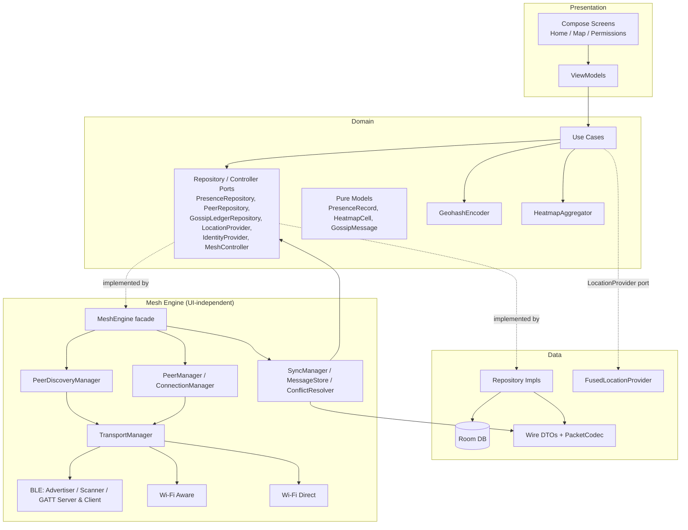

# Architecture

CrowdMesh is a single `:app` Gradle module organized as clean-architecture
*packages* rather than separate Gradle modules — see the "single module vs.
multi-module" trade-off note at the bottom of this document.

## Layers

Dependency direction is strictly inward: `presentation -> domain <- data`
and `mesh -> domain` (mesh never depends on `presentation`, and `data` never
depends on `mesh`). `domain` has zero Android framework dependencies except
where noted below.

## Component responsibilities

| Component | Responsibility |
|---|---|
| `domain.usecase.*` | One class per user-visible action (`UpdatePresenceUseCase`, `ObserveHeatmapUseCase`, ...) |
| `domain.repository.*` | Ports: interfaces `data` and `mesh` implement, so `domain` never imports either |
| `domain.geohash.GeohashEncoder` | Pure base32 geohash encode/decode, no dependencies |
| `domain.heatmap.HeatmapAggregator` | Groups records into cells, computes confidence decay + density bucket |
| `data.local.*` | Room entities/DAOs — the only three tables in the app |
| `data.repository.*` | Implements the domain ports against Room, applying LWW at persistence time |
| `data.serialization.*` | ProtoBuf wire DTOs + `PacketCodec` (type byte + payload framing) |
| `mesh.protocol.*` | Packet type enum, protocol/MTU constants |
| `mesh.ble.*` | BLE advertiser, scanner, GATT server/client, MTU chunking + reassembly, adaptive scan scheduling |
| `mesh.transport.*` | `Transport` interface + `TransportManager` (fan-out across available radios) |
| `mesh.discovery.PeerDiscoveryManager` | Thin facade `MeshEngine` uses for discovery/advertising |
| `mesh.peer.*` | Decides which discovered peers are worth a connection; caps concurrent connections |
| `mesh.sync.*` | The gossip protocol itself: digest exchange, dedup/TTL/hop bookkeeping, LWW resolution |
| `mesh.MeshEngine` | The facade: wires everything above together, implements `MeshController` |
| `identity.DeviceIdentityProvider` | Random UUID, generated once, persisted via DataStore |
| `work.*` | `PeriodicMeshSyncWorker` (bounded background burst), `ExpiredRecordCleanupWorker` |
| `presentation.*` | Compose UI, ViewModels, navigation, permission gating |

## Why a single Gradle module

A true multi-module split (`:core-mesh`, `:core-data`, `:feature-map`, ...)
buys stronger build-time enforcement of the dependency graph, at the cost of
real Gradle wiring overhead — inter-module `api`/`implementation`
declarations, more `build.gradle.kts` files, slower initial configuration.
For a prototype at this stage, package-level separation with the dependency
directions above gives nearly the same architectural clarity for a fraction
of the build-config surface area. If/when this grows past a single team or
needs independent build/test cycles per feature, the package boundaries
above are already drawn along the lines a module split would follow.

## Known simplifications (see also `docs/PROTOCOL.md`)

- **Cross-transport peer identity isn't correlated.** BLE, Wi-Fi Aware, and
  Wi-Fi Direct each have their own addressing; the same physical phone
  reachable over two radios looks like two unrelated peers. Harmless
  (gossip merges are idempotent) but wasteful. A production version would
  exchange a transport-agnostic identity early and dedupe on it.
- **Wi-Fi Aware** exchanges mesh frames as discovery messages (~250
  bytes/message) rather than standing up a full data-path network
  specifier + socket — plenty of bandwidth for presence records, far less
  code.
- **Wi-Fi Direct** discovery sees any nearby P2P device (no DNS-SD
  service-specific filtering), and only forms one group connection per
  discovery cycle in this implementation.
