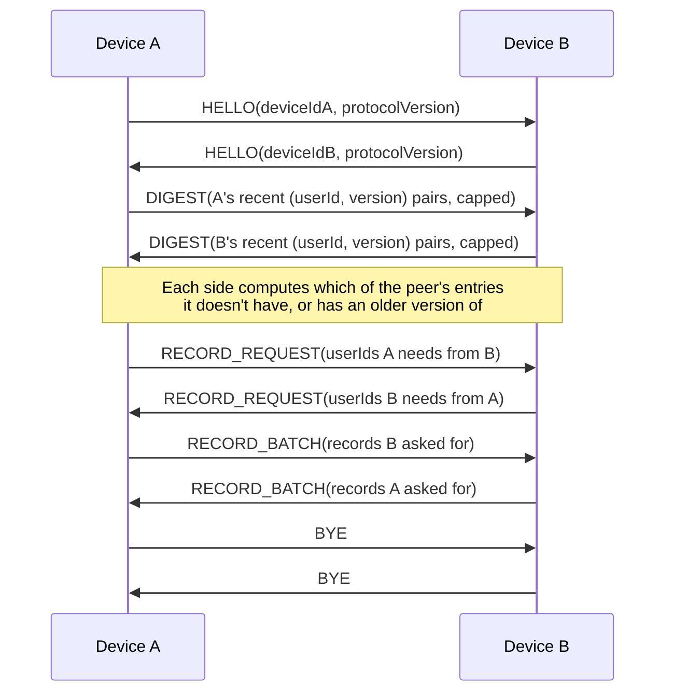

# CrowdMesh Gossip Protocol Specification

## Overview

Two devices that discover each other (over any transport) run the same
symmetric handshake concurrently — there is no fixed "client"/"server" role
at the protocol level, even though the underlying radio connection is
asymmetric (e.g. BLE central vs. peripheral). Both sides:

1. Exchange identity (`HELLO`).
2. Exchange a bounded summary of what they know (`DIGEST`).
3. Tell each other what they're missing (`RECORD_REQUEST`).
4. Send exactly the records the other side asked for (`RECORD_BATCH`).
5. Say goodbye (`BYE`).

Only records a peer is actually missing or has a strictly older version of
are ever transmitted — this is need-driven exchange, not flooding.

## Framing

### Logical message framing (`PacketCodec`)

Every logical message is:

```
+----------------+----------------------------+
| type (1 byte)  | ProtoBuf payload (N bytes)  |
+----------------+----------------------------+
```

`type` is one of:

| Value | Name | Payload |
|---|---|---|
| `0x01` | `HELLO` | `HelloDto { deviceId: String, protocolVersion: Int32 }` |
| `0x02` | `DIGEST` | `DigestDto { entries: List<DigestEntryDto{ userId: String, version: Int64 }> }` |
| `0x03` | `RECORD_REQUEST` | `RecordRequestDto { userIds: List<String> }` |
| `0x04` | `RECORD_BATCH` | `RecordBatchDto { records: List<PresenceRecordWireDto> }` |
| `0x05` | `BYE` | *(empty)* |

`PresenceRecordWireDto`:

```
messageId:     String   -- deterministic "<userId>:<version>", not a fresh
                            random UUID per hop (see "Message identity" below)
userId:        String
geohash:       String   -- base32 geohash, precision 8 by default
timestamp:     Int64    -- epoch millis when the fix was captured
version:       Int64    -- monotonically increasing per userId
ttlExpiresAt:  Int64    -- absolute epoch millis after which this is stale
hopCount:      Int32    -- relay depth bookkeeping (see below)
```

### Transport-level chunk framing (BLE only)

BLE GATT writes/notifications are capped by the negotiated ATT MTU
(`BleConstants.GATT_MTU_REQUEST_BYTES = 217`, leaving ~214 usable payload
bytes). `mesh.ble.MessageFramer` splits a logical message into chunks, each
prefixed once (on the first chunk) with the total message length:

```
first chunk:  [ length: 4 bytes big-endian ][ payload chunk ]
next chunks:  [ payload chunk ]
```

The receiving side's `MessageFramer.Reassembler` accumulates chunks until
the declared length is reached, then hands the complete logical message to
`PacketCodec.decode`. Wi-Fi Direct's plain TCP socket transport uses the
same style of length-prefixing but as a single write per message (no MTU to
chunk around); Wi-Fi Aware reuses `MessageFramer` at a smaller chunk size
tuned to Aware's ~250-byte message cap.

## State machine (per connection)



If either side times out waiting for a step (10s default,
`SyncManager.RECEIVE_TIMEOUT_MILLIS`), the sync is abandoned for that
connection — safe to do since nothing is ever partially applied: a record
is only merged once its *entire* `RECORD_BATCH` message has been received
and decoded.

## Conflict resolution: latest version wins

`mesh.sync.ConflictResolver.isNewer(local, remote)`:

1. If there is no local record for that `userId`, `remote` is newer.
2. Else if `remote.version > local.version`, `remote` is newer.
3. Else if `remote.version == local.version && remote.timestamp > local.timestamp`,
   `remote` is newer (tie-break).
4. Otherwise, `remote` is not newer and is discarded.

This rule is applied twice, deliberately: once during digest diffing (to
decide whether to even *request* a record) and again, independently, at
persistence time in `PresenceRepositoryImpl.mergeRemoteRecord` (the
authoritative gate). A `PresenceRecord` never has more than one row per
`userId` — every write is a replace.

## Deduplication, TTL, and hop count

- **Message identity.** `messageId` is deterministic — `"<userId>:<version>"`
  — not a fresh random UUID minted on every relay. This means every device
  that ever re-shares the same version of the same user's record produces
  an *identical* `messageId`, so `MessageStore`'s dedup ledger correctly
  recognizes "I've already fully processed this exact update" regardless of
  how many hops or which peer it arrived via.
- **TTL.** `GossipPolicy.RECORD_TTL_MILLIS` (default 30 minutes) after the
  fix's own `timestamp`. Expired records are dropped on read
  (`MessageStore.shouldProcess`) and swept periodically
  (`ExpiredRecordCleanupWorker` + `PresenceRepository.pruneExpired`).
- **Hop count.** Capped at `GossipPolicy.MAX_HOPS` (default 6). In this
  design, every device that merges a record into local storage treats
  itself as an equally valid source of it for the *next* peer it meets —
  outgoing `GossipMessage`s built from local storage are always stamped
  `hopCount = 0`. `hopCount` is still checked defensively on receipt
  (`message.hopCount < MAX_HOPS`) as a guard against a misbehaving or
  future flood-relay-without-merge extension, but under normal operation
  the actual amplification limiter is need-driven digest diffing, not hop
  count: a peer is never sent a record they already have at an equal or
  newer version, which bounds total transmissions by the number of
  distinct `(userId, version)` pairs in existence, not by hop depth.
- **Digest bound.** `GossipPolicy.DIGEST_ENTRY_LIMIT` (default 500) caps how
  many `(userId, version)` pairs go into one `DIGEST` — the practical
  scalability limiter at tens-of-thousands-of-users scale: a single
  encounter only ever reconciles the most recently updated slice of the
  mesh, and full propagation happens gradually across many encounters as
  people move, which is the explicitly accepted "eventual consistency"
  model for this app.

## Protocol version

`ProtocolConstants.PROTOCOL_VERSION = 1`, exchanged in `HELLO`. A mismatch
aborts the sync for that connection (see `SyncManager.syncOverConnection`).
There is no negotiation/fallback for older versions in this prototype.
