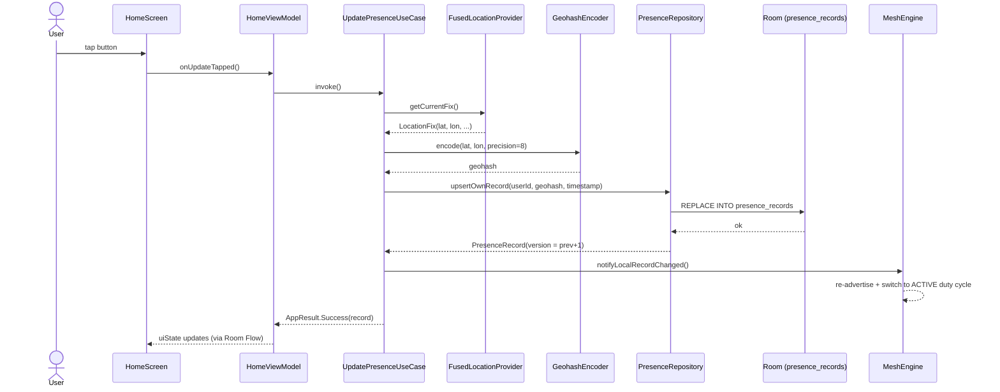
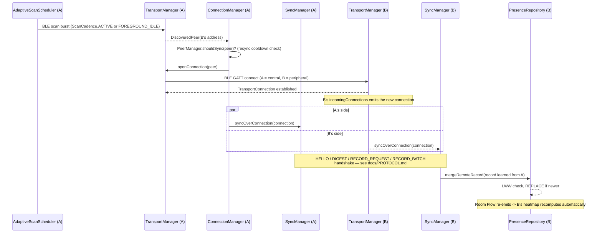
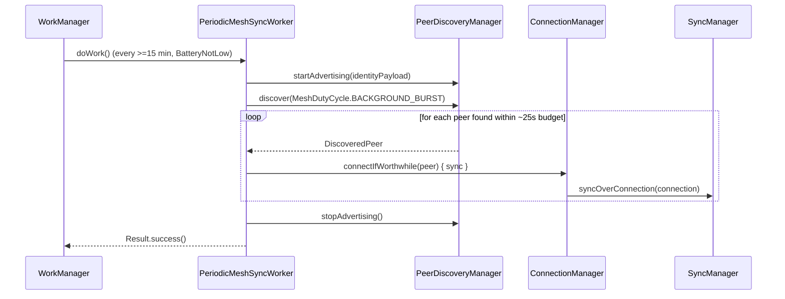
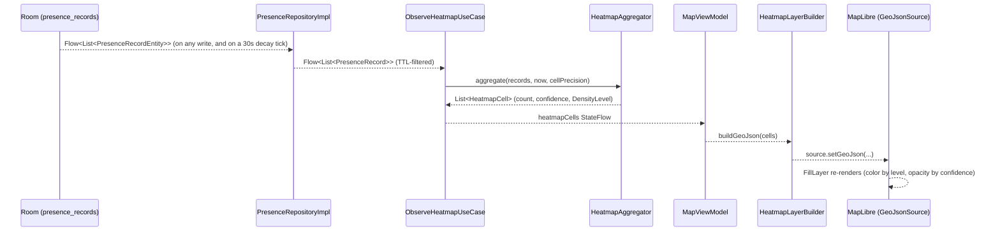

# Sequence Diagrams

Four flows that together cover the whole app. (The gossip wire handshake
itself is diagrammed separately in `docs/PROTOCOL.md` — this file shows how
each flow drives it, not the packet-level detail.)

## 1. Tapping "Update My Presence"

If `LocationProvider.getCurrentFix()` returns `null` (no permission, no
signal, timeout), `UpdatePresenceUseCase` returns
`AppResult.Failure(LOCATION_UNAVAILABLE)` and nothing is written — the UI
surfaces a Snackbar and the button becomes tappable again immediately.

## 2. Two peers meet: discovery through gossip merge

## 3. Background sync via WorkManager

`ExpiredRecordCleanupWorker` runs independently, roughly hourly, and simply
calls `PruneExpiredRecordsUseCase` — no radios involved.

## 4. Heatmap render pipeline

Nothing in this pipeline ever leaves the device, and no image or rendered
heatmap is ever part of the gossip protocol — only the underlying
`PresenceRecord`s are (see step 2 above).
